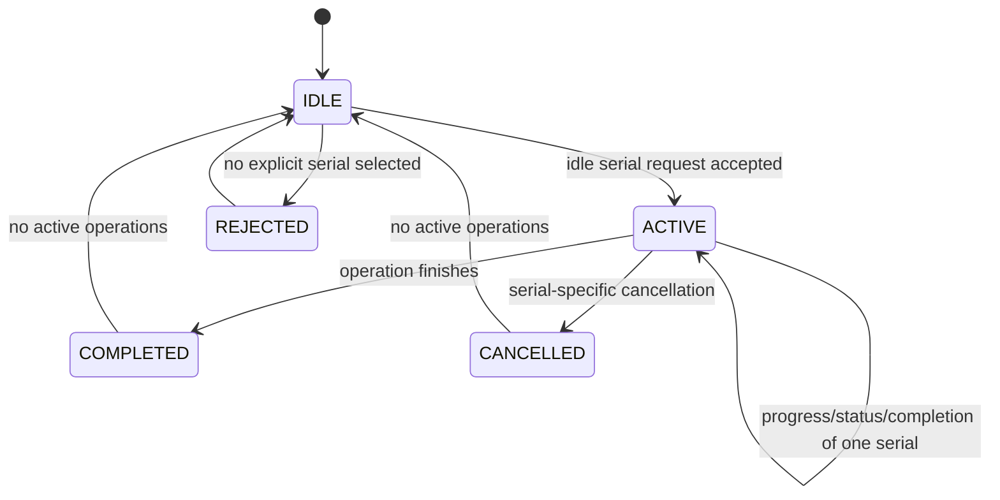

# Independent Per-Device Transfer Simulation Report

## Architecture

The production controller now maintains independent operation records keyed by
ADB serial:

```text
AppController
  active_operations["SERIAL_A"] -> operation + dedicated ADBEngine instance
  active_operations["SERIAL_B"] -> operation + dedicated ADBEngine instance
  active_operations["SERIAL_C"] -> operation + dedicated ADBEngine instance
```

Each operation owns its serial, game, source/destination or APK, status,
progress, speed, ETA, error, cancellation state, worker engine, and completion
state. Different serials start immediately and do not wait for one another.
The same serial is rejected while its operation is incomplete.

## Actual state and flow map

```text
APPLICATION START
  -> AppController initializes discovery engine and signals
  -> IDLE / no active operations
  -> ADB discovery returns serial/model records
  -> adbDevicesChanged updates the separate QML device selector
  -> user explicitly selects one or more serials
  -> COPY or INSTALL request
  -> source/APK validation
  -> per-serial busy check
       busy serial -> reject that serial
       idle serial -> create operation and dedicated ADBEngine
  -> operation starts immediately for each idle serial
  -> progress/status updates only that serial's QML row
  -> success / failure / cancellation completes only that operation
  -> other serial operations continue independently
  -> active operation map becomes empty
  -> IDLE
```



## Simulation scenarios

| Scenario | Result |
|---|---|
| Discovery returns A, B, C and QML receives all serials | PASS |
| Zero-device COPY rejection | PASS |
| Zero-device INSTALL rejection | PASS |
| A starts, then B starts while A is active | PASS |
| A, B, C active simultaneously | PASS |
| Busy A rejected while idle B starts | PASS |
| A failure leaves B and C unaffected | PASS |
| Cancel A leaves B and C running | PASS |
| A completion does not affect B | PASS |
| A/B completion in independent order | PASS |
| Duplicate completion for A is ignored | PASS |
| Three simultaneous installations | PASS |
| Cancel A while B installs | PASS |
| Exact serial targeting | PASS |
| Per-device progress/status/speed/ETA/error state | PASS |
| Dedicated process ownership and stale cleanup protection | PASS |
| No artificial install percentage | PASS |
| PUBG/COD path blocks match HEAD | PASS |
| Deterministic repeat, run 1 | PASS |
| Deterministic repeat, run 2 | PASS |

## Invariants

All requested invariants passed:

```text
I1  Maximum one operation per device serial.
I2  Different serials run concurrently.
I3  A second operation on a busy serial is rejected.
I4  Manual COPY requires explicit selection.
I5  Manual INSTALL requires explicit selection.
I6  Manual operations do not select devices[0].
I7  Every operation uses its exact serial.
I8  Failure on A does not affect B.
I9  Cancelling A does not affect B.
I10 Completing A does not affect B.
I11 Progress and status are serial-specific.
I12 Idle serials can start immediately.
I13 Operation workers remain off the GUI thread.
I14 Installation has no fake percentage completion.
I15 PUBG/COD path logic is unchanged.
```

## Validation command

```text
QT_QPA_PLATFORM=offscreen python validation/multi_device_simulation.py
```

The harness uses deterministic in-memory devices, worker engines, process
doubles, and controlled signal events. It prints:

```text
RUN 1: ALL PASS
RUN 2: ALL PASS
```

## Limitations

Physical Windows ADB behavior, actual process-tree termination, real device
disconnect timing, throughput, and APK installation output still require
manual testing with connected devices. No hardware or real `adb.exe` was used.
